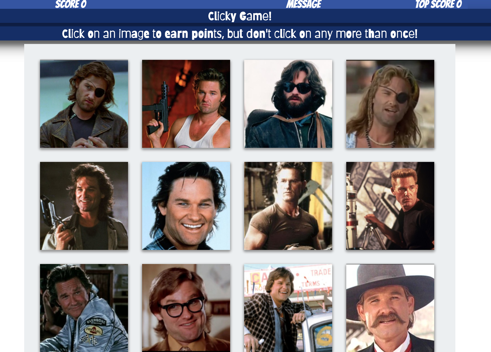

### Clicky Game 🥢🧐🚚

https://rachaelbelle.github.io/ClickyGame/

## About

Kurt Russell Clicky Game.  It's a memory game created with React.  Don't click the same Kurt twice!!  (But MacReady is worthy of several clicks 😉)

Should you be successful, you'll score a 12 out of 12.

---------------------------------------------------------------------------------------

## Instructions

Each time the user clicks on an image, the pictures are shuffled. The task for the user is to click on each image once and only once.

The application keeps track of the user's score. Each time the user clicks on an image for the first time in the current round, their Correct Guesses score is incremented

If the user clicks on an image they're already clicked on in the current round, their Correct Guesses score is reset to 0.

The application keeps track of the users Best Score, and updates it when the user achieves a new Best Score.

 

<kbd>
  
</kbd>

## Good Luck!

While Kurt is handsome and distracting, I believe you can do this.
